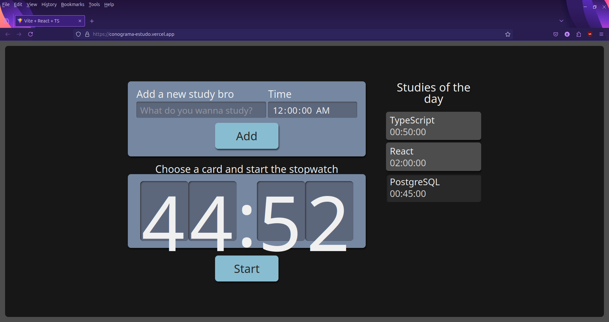

# Study Timer App

Este é um sistema simples de gerenciamento de estudos onde você pode adicionar tarefas de estudo, definir o tempo de estudo para cada tarefa e, ao término do tempo, a tarefa é automaticamente marcada como finalizada. O projeto foi desenvolvido com React e TypeScript para aprimorar minhas habilidades nessas tecnologias.

## Funcionalidades

- Adicione novas tarefas de estudo com um nome e um tempo específico.
- Acompanhe o tempo de estudo restante para cada tarefa.
- As tarefas são automaticamente marcadas como finalizadas quando o tempo de estudo se esgota.

## Tecnologias Utilizadas

- **React**: Biblioteca JavaScript para construção de interfaces de usuário.
- **TypeScript**: Superset de JavaScript que adiciona tipagem estática ao código.
- **SCSS**: Usado para estilização do projeto.
  

